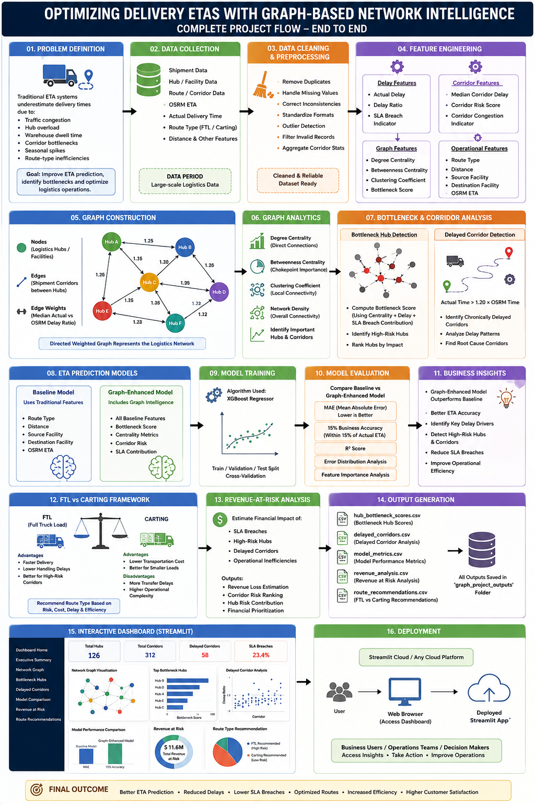

# 🚚 Optimizing Delivery ETAs with Graph-Based Network Intelligence

A Graph Analytics and Machine Learning project focused on improving logistics ETA prediction, detecting bottleneck hubs, analyzing delayed corridors, and generating operational intelligence for logistics networks.

---

# 📌 Project Overview

Traditional ETA systems such as OSRM estimate delivery times mainly using shortest paths and expected road conditions. However, real-world logistics operations are affected by:

* Traffic congestion
* Hub overload
* Corridor bottlenecks
* Warehouse dwell time
* Seasonal shipment spikes
* Route-type inefficiencies

This project models the logistics system as a **Directed Weighted Graph** where:

* Logistics hubs → Nodes
* Shipment corridors → Edges
* Delay risk → Edge weights

Using Graph Analytics and Machine Learning, the system can:

* Improve ETA prediction
* Detect bottleneck hubs
* Identify delayed corridors
* Estimate SLA breach contribution
* Recommend FTL vs Carting decisions
* Estimate operational revenue-at-risk

---

# 🎯 Business Objectives

* Improve ETA prediction accuracy
* Detect structurally risky logistics hubs
* Identify chronically delayed corridors
* Reduce SLA breaches
* Optimize route-type decisions
* Support operational planning and strategy

---

# ⚙️ Features

* Graph-Based Logistics Network
* Bottleneck Hub Detection
* Delayed Corridor Analysis
* Graph-Enhanced ETA Prediction
* SLA Breach Analysis
* Revenue-at-Risk Estimation
* FTL vs Carting Recommendation Framework
* Interactive Streamlit Dashboard

---

# 🌐 Graph Construction

The logistics network was modeled as a **Directed Weighted Graph**.

## Nodes

Represent logistics hubs/facilities.

## Edges

Represent shipment corridors between hubs.

## Edge Weights

Represent median actual-vs-OSRM delay ratio.

---

# 📈 Graph Analytics

The following graph metrics were computed:

* Degree Centrality
* Betweenness Centrality
* Clustering Coefficient
* Bottleneck Scores

These metrics helped identify:

* High-risk hubs
* Operational chokepoints
* Congested corridors

---

# 🤖 ETA Prediction Models

## Baseline Model

Uses:

* Distance
* Route Type
* Source Facility
* Destination Facility
* OSRM Time

---

## Graph-Enhanced Model

Additional graph intelligence features:

* Bottleneck Score
* Centrality Metrics
* Corridor Risk
* SLA Contribution

---

# 🚛 FTL vs Carting Framework

The project recommends:

* FTL for high-risk corridors
* Carting for lower-risk operational routes

based on:

* Delay risk
* Bottleneck score
* Corridor congestion
* Operational efficiency

---

# 💰 Revenue-at-Risk Analysis

The project estimates:

* SLA breach impact
* Corridor-level operational risk
* Financial risk contribution from bottleneck hubs

---

# 📊 Streamlit Dashboard

The project includes an interactive Streamlit dashboard featuring:

* Executive KPI Overview
* Network Graph Visualization
* Bottleneck Hub Analytics
* Delayed Corridor Analysis
* ETA Model Comparison
* Revenue-at-Risk Insights
* Strategy Recommendations

---

# 🛠️ Tech Stack

* Python
* Pandas
* NumPy
* NetworkX
* XGBoost
* Scikit-Learn
* Plotly
* Streamlit

---

# 📂 Project Structure

```text
├── graph_project_outputs/
│   ├── hub_bottleneck_scores.csv
│   ├── delayed_corridors.csv
│   ├── model_metrics.csv
│   ├── revenue_analysis.csv
│   └── other output CSV files
│
├── app.py
├── projecttrained.py
├── graph.html
├── requirements.txt
└── README.md
```

---

# 🚀 Running the Dashboard

Install dependencies:

```bash
pip install -r requirements.txt
```

Run Streamlit dashboard:

```bash
streamlit run app.py
```

---

# 📸 Deliverables

* Graph-Based Logistics Network
* Bottleneck Hub Detection System
* Delayed Corridor Analysis
* Graph-Enhanced ETA Prediction Model
* FTL vs Carting Recommendation Framework
* Revenue-at-Risk Analysis
* Interactive Streamlit Dashboard
* Technical Research Report

---

# 📜 Key Takeaways

* Graph intelligence improves ETA prediction quality.
* Bottleneck hubs contribute heavily to SLA breaches.
* Corridor-level analysis reveals hidden operational risks.
* Graph-enhanced ML models outperform traditional ETA systems.
* Logistics networks should be analyzed as interconnected systems instead of isolated routes.

---

# ⭐ Conclusion

This project demonstrates how Graph Analytics and Machine Learning can transform logistics operations into intelligent network-aware systems capable of:

* Better ETA prediction
* Delay risk detection
* Operational optimization
* Infrastructure planning
* SLA breach reduction

The final solution combines:

* Graph Intelligence
* Machine Learning
* Operational Analytics
* Interactive Visualization

to create a scalable logistics intelligence platform.

---

